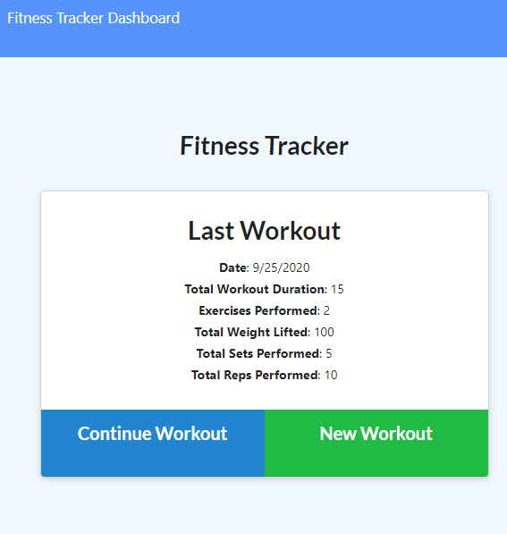
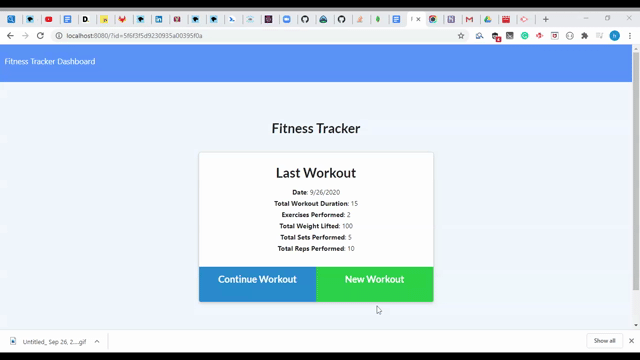

# workout-tracker

## Description
This workout tracker application is developed to enable the consumer to track their workout progress so that they can reach their workout progress. The app will keep track of every exercise in your workout. The app dashboard will display weekly summary graphs of all workouts done in a week. The NodeJs, Mongo Database, and routes with Express are the tools and programs used for the development of the app.
## Installation
The application is deployed on Heroku. You can run the application from the following link below.
   * https://track-your-fitness.herokuapp.com/?id=5e3b1ea870e2390017f01261
## Usage
* A user can view the last workout 

* A user can create a workout

<<<<<<< HEAD
* A user can
=======
* A user can see the summary of all workouts from stats page.

## Test
none

>>>>>>> 70725c5480ef1add91366b781684a9901bf876d9

